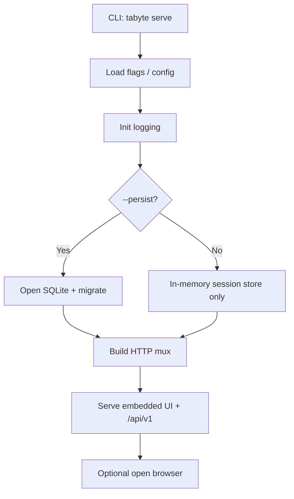

# Tabyte — Architecture v0.3

## Decision

Tabyte is a **modular Go monolith** in a single local process: CLI bootstrap, local HTTP server, embedded static UI, and optional SQLite as a peripheral adapter. Domain rules stay at the center; HTTP handlers, parser, engines, and SQLite are edges.

This matches a local-first product: low operational complexity, one binary, dependencies pointing inward.

## Package layout (implemented)

```text
cmd/tabyte/                   executable entrypoint
internal/runtime/             bootstrap and process lifecycle (serve)
internal/httpapi/             HTTP handlers, JSON envelope, UI routes
internal/application/         orchestration (sessions, estimates, growth, warnings)
internal/domain/              core models and contracts
internal/parser/              structural DDL parsing
internal/engine/postgres/     PostgreSQL normalize + estimate
internal/engine/sqlserver/    SQL Server normalize + estimate
internal/persistence/sqlite/  optional local store (--persist)
internal/platform/            OS helpers (e.g. open browser)
web/                          static UI assets (HTML/CSS/JS) embedded via embed
```

## Layers

| Layer | Responsibility |
|---|---|
| Runtime | CLI flags, bind address, optional SQLite open, HTTP listen, browser open |
| Interface | `httpapi` + embedded `web` assets |
| Application | Session lifecycle, hydrate estimates, warnings/signals, growth, insights adapter |
| Domain | Session, table, column, index, warning, signal, engine identity |
| Infrastructure | SQLite adapter, platform browser helper |

Rules:

- Handlers and SQLite never own core estimation rules.
- Parser interprets structure; engines apply engine-specific normalize/estimate rules.
- SQLite depends on application/domain ports, not the reverse.

## Runtime composition



## UI / API boundary

- UI is static files under `web/`, served at `GET /` and `GET /assets/…`.
- UI talks to the local API under `/api/v1` with JSON envelopes.
- Analysis results (tables, calculation, warnings, signals) are returned nested in session create/get responses; dedicated sub-collection routes are deferred.

## Architectural risks to avoid

- Domain logic leaking into HTTP handlers
- Parser mixed with engine-specific estimation
- SQLite becoming a structural dependency of the domain
- Generic “utils” packages accumulating business rules
- Tight coupling between UI markup and unstable internal structs without a clear JSON contract

## Planned evolution (non-breaking)

- Additional engines
- Richer persistence (columns/indexes tables if needed)
- Real AI insight providers behind the existing interface
- Optional file-import endpoint
- Extra CLI automations

Growth should keep local deployment as a single process with an embedded UI.
