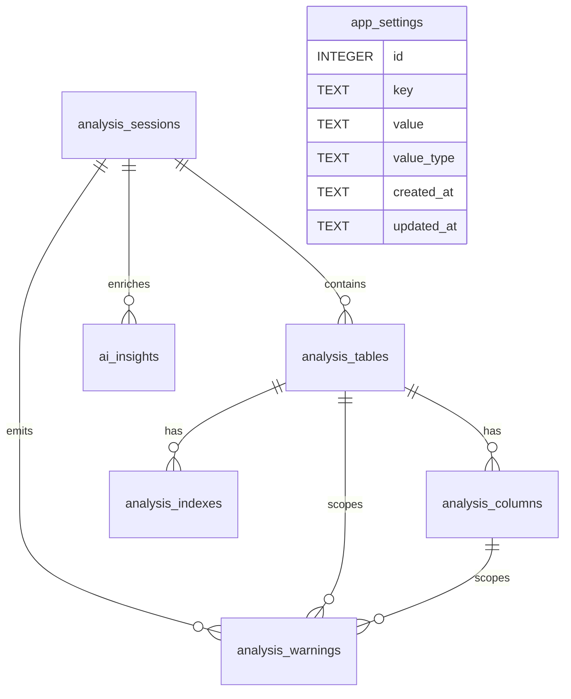

# Tabyte — Modelo de Entidades SQLite Interno v0.2

## Objetivo

Este documento descreve o **modelo de entidades internas em SQLite** para o Tabyte. O foco aqui não é especificar comportamento funcional do sistema, mas definir uma estrutura de persistência local pequena, clara e coerente com o papel do SQLite como formato de aplicação embarcado e armazenamento interno local [1][2].

A proposta assume que o SQLite será usado apenas como mecanismo opcional de persistência local, sem substituir o domínio da aplicação e sem introduzir dependência de banco servidor externo. Esse uso é consistente com a documentação do SQLite, que o apresenta como formato apropriado para aplicações desktop, preferências, caches, estado local e arquivos de aplicação [1][2][3].

## Princípios de modelagem

- O banco SQLite é **interno** ao Tabyte e não constitui interface pública de integração [1][2].
- O schema deve ser **pequeno, auditável e migrável** localmente.
- O banco não é o centro do domínio; ele apenas persiste artefatos úteis do uso local.
- O modelo deve privilegiar tipos nativos simples do SQLite, que trabalha com tipagem dinâmica e afinidades de tipo, em vez de tentar reproduzir tipagem rígida de bancos servidores [4][5].
- Os relacionamentos devem usar chaves estrangeiras explícitas, lembrando que SQLite possui suporte a foreign keys, desde que corretamente utilizado pela aplicação [6][7].

## Escopo de persistência

O SQLite interno deve persistir apenas quatro grupos de informação:

1. Configurações locais da aplicação.
2. Sessões de análise executadas pelo usuário.
3. Resultados estruturados resumidos dessas análises.
4. Metadados auxiliares, como alertas e, futuramente, insights opcionais de IA.

Esse recorte evita transformar o banco interno em repositório excessivo ou em duplicação desnecessária do modelo de domínio em memória [1][3].

## Convenções gerais

### Tipos SQLite recomendados

Por simplicidade e aderência ao funcionamento real do SQLite, recomenda-se restringir o modelo aos tipos principais abaixo [4][8][5]:

- `INTEGER` para contadores, flags booleanas e valores integrais.
- `REAL` para valores fracionários simples.
- `TEXT` para identificadores textuais, nomes, timestamps ISO-8601 e JSON serializado.
- `BLOB` apenas se no futuro houver necessidade concreta de conteúdo binário.

### Convenções de dados

- Identificadores técnicos podem ser `TEXT` com UUID/ULID ou `INTEGER` autoincremental, conforme a necessidade de legibilidade e sincronização local.
- Datas e horários devem ser armazenados como `TEXT` em ISO-8601 para facilitar inspeção e portabilidade [4][5].
- Booleanos devem ser armazenados como `INTEGER` com `0` e `1`, prática coerente com o ecossistema SQLite [9].
- Estruturas flexíveis pequenas podem ser armazenadas como JSON serializado em colunas `TEXT`.

## Entidades propostas

### 1. app_settings

Armazena configurações locais da instalação.

#### Finalidade

Persistir preferências técnicas e operacionais da aplicação, evitando hardcode ou dependência exclusiva de arquivo solto de configuração.

#### Campos

| Campo | Tipo SQLite | Obrigatório | Observação |
|---|---|---:|---|
| id | INTEGER | Sim | Chave primária técnica. |
| key | TEXT | Sim | Nome único da configuração. |
| value | TEXT | Sim | Valor serializado. |
| value_type | TEXT | Sim | Ex.: `string`, `int`, `bool`, `json`. |
| created_at | TEXT | Sim | Timestamp ISO-8601. |
| updated_at | TEXT | Sim | Timestamp ISO-8601. |

#### Observações

- `key` deve possuir restrição única.
- Essa tabela substitui múltiplos arquivos soltos de preferência quando a persistência estiver ativada.

### 2. analysis_sessions

Representa uma sessão de análise realizada localmente.

#### Finalidade

Registrar a unidade principal de persistência de uso: uma execução analítica sobre determinado input estrutural.

#### Campos

| Campo | Tipo SQLite | Obrigatório | Observação |
|---|---|---:|---|
| id | TEXT | Sim | Identificador estável da sessão. |
| engine | TEXT | Sim | Engine lógica da análise. |
| source_name | TEXT | Não | Nome amigável do input. |
| ddl_text | TEXT | Sim | DDL original persistido. |
| ddl_hash | TEXT | Sim | Hash para rastreio e deduplicação. |
| parser_status | TEXT | Sim | Estado geral do parsing. |
| total_tables | INTEGER | Sim | Quantidade de tabelas interpretadas. |
| warning_count | INTEGER | Sim | Quantidade total de alertas. |
| error_count | INTEGER | Sim | Quantidade total de erros. |
| estimated_total_bytes | INTEGER | Não | Resultado agregado em bytes. |
| created_at | TEXT | Sim | Timestamp ISO-8601. |
| updated_at | TEXT | Sim | Timestamp ISO-8601. |

#### Observações

- `ddl_text` é útil para reabrir contexto local e reproduzir análise.
- `ddl_hash` ajuda a identificar repetição de inputs semelhantes.

### 3. analysis_tables

Representa o resultado resumido por tabela dentro de uma sessão.

#### Finalidade

Permitir navegação posterior pelo detalhamento estrutural de cada tabela analisada sem depender de recálculo imediato.

#### Campos

| Campo | Tipo SQLite | Obrigatório | Observação |
|---|---|---:|---|
| id | TEXT | Sim | Identificador da tabela persistida. |
| session_id | TEXT | Sim | FK para `analysis_sessions.id`. |
| schema_name | TEXT | Não | Nome lógico do schema. |
| table_name | TEXT | Sim | Nome da tabela. |
| row_size_bytes | INTEGER | Não | Tamanho estimado por linha. |
| row_count_assumed | INTEGER | Sim | Cardinalidade assumida. |
| growth_rate_value | REAL | Não | Taxa de crescimento usada. |
| growth_rate_unit | TEXT | Não | Unidade da taxa. |
| estimated_table_bytes | INTEGER | Não | Resultado total estimado. |
| index_bytes | INTEGER | Não | Parcela de índice, se calculada. |
| warning_count | INTEGER | Sim | Número de alertas ligados à tabela. |
| created_at | TEXT | Sim | Timestamp ISO-8601. |
| updated_at | TEXT | Sim | Timestamp ISO-8601. |

#### Observações

- Recomenda-se índice por `session_id`.
- `schema_name + table_name` não precisa ser globalmente único; a unicidade deve ser contextual à sessão.

### 4. analysis_columns

Representa o detalhamento persistido de colunas por tabela.

#### Finalidade

Preservar rastreabilidade local do resultado por coluna, incluindo tipo original e tipo normalizado.

#### Campos

| Campo | Tipo SQLite | Obrigatório | Observação |
|---|---|---:|---|
| id | TEXT | Sim | Identificador da coluna persistida. |
| table_id | TEXT | Sim | FK para `analysis_tables.id`. |
| column_name | TEXT | Sim | Nome da coluna. |
| ordinal_position | INTEGER | Sim | Ordem original no DDL. |
| original_type | TEXT | Sim | Tipo textual encontrado. |
| normalized_type | TEXT | Sim | Tipo lógico normalizado internamente. |
| length_value | INTEGER | Não | Comprimento aplicável. |
| precision_value | INTEGER | Não | Precisão aplicável. |
| scale_value | INTEGER | Não | Escala aplicável. |
| is_nullable | INTEGER | Sim | `0` ou `1`. |
| estimated_bytes | INTEGER | Não | Estimativa atribuída. |
| notes_json | TEXT | Não | Observações técnicas opcionais. |
| created_at | TEXT | Sim | Timestamp ISO-8601. |

#### Observações

- `notes_json` deve ser usado com parcimônia, apenas quando de fato agregar contexto auxiliar.

### 5. analysis_indexes

Representa estruturas de índice persistidas na análise.

#### Finalidade

Registrar os índices declarados ou inferidos que participam do resultado persistido.

#### Campos

| Campo | Tipo SQLite | Obrigatório | Observação |
|---|---|---:|---|
| id | TEXT | Sim | Identificador do índice persistido. |
| table_id | TEXT | Sim | FK para `analysis_tables.id`. |
| index_name | TEXT | Não | Nome do índice, quando conhecido. |
| index_type | TEXT | Não | Tipo lógico do índice. |
| column_list | TEXT | Sim | Lista serializada das colunas participantes. |
| is_unique | INTEGER | Sim | `0` ou `1`. |
| estimated_bytes | INTEGER | Não | Estimativa associada. |
| source_kind | TEXT | Sim | Origem lógica, como `declared` ou `inferred`. |
| created_at | TEXT | Sim | Timestamp ISO-8601. |

#### Observações

- `column_list` pode começar como texto serializado simples e evoluir depois, caso necessário.

### 6. analysis_warnings

Representa alertas estruturais associados a uma sessão, tabela ou coluna.

#### Finalidade

Persistir observações relevantes ao resultado local, preservando explicabilidade e auditoria mínima de análise.

#### Campos

| Campo | Tipo SQLite | Obrigatório | Observação |
|---|---|---:|---|
| id | TEXT | Sim | Identificador do alerta. |
| session_id | TEXT | Sim | FK para `analysis_sessions.id`. |
| table_id | TEXT | Não | FK opcional para `analysis_tables.id`. |
| column_id | TEXT | Não | FK opcional para `analysis_columns.id`. |
| code | TEXT | Sim | Código técnico do alerta. |
| severity | TEXT | Sim | Severidade lógica. |
| category | TEXT | Sim | Categoria semântica. |
| title | TEXT | Sim | Título resumido. |
| message | TEXT | Sim | Texto do alerta. |
| created_at | TEXT | Sim | Timestamp ISO-8601. |

#### Observações

- Os três níveis de escopo possíveis são: sessão, tabela e coluna.
- `code` facilita filtragem e tratamento evolutivo na UI.

### 7. ai_insights

Representa insights opcionais gerados por integração futura com IA.

#### Finalidade

Separar de forma explícita recomendações textuais probabilísticas dos resultados determinísticos do domínio.

#### Campos

| Campo | Tipo SQLite | Obrigatório | Observação |
|---|---|---:|---|
| id | TEXT | Sim | Identificador do insight. |
| session_id | TEXT | Sim | FK para `analysis_sessions.id`. |
| provider | TEXT | Sim | Provedor usado. |
| model_name | TEXT | Não | Nome do modelo. |
| prompt_version | TEXT | Não | Versão do prompt. |
| category | TEXT | Sim | Categoria do insight. |
| confidence_label | TEXT | Não | Grau textual de confiança. |
| insight_text | TEXT | Sim | Conteúdo do insight. |
| created_at | TEXT | Sim | Timestamp ISO-8601. |

#### Observações

- Essa tabela não deve existir no primeiro ciclo se a funcionalidade de IA ainda não estiver ativada; pode ser tratada como extensão futura.

## Relacionamentos lógicos

## Índices recomendados

Para manter simplicidade e boa navegação local, recomenda-se inicialmente:

- índice único em `app_settings(key)`;
- índice em `analysis_sessions(ddl_hash)`;
- índice em `analysis_tables(session_id)`;
- índice em `analysis_columns(table_id)`;
- índice em `analysis_indexes(table_id)`;
- índice em `analysis_warnings(session_id)`;
- índice composto opcional em `analysis_warnings(table_id, column_id)`.

Esses índices são suficientes para navegação interna do produto sem sofisticar prematuramente o schema [6][2].

## Restrições de integridade recomendadas

- Chaves primárias explícitas em todas as tabelas.
- Foreign keys declaradas entre sessão, tabela, coluna, índice e alerta [6][7].
- `NOT NULL` em campos estruturais essenciais.
- `UNIQUE` em `app_settings.key`.
- `CHECK` simples quando agregar clareza, por exemplo para flags booleanas `IN (0,1)`.

## Observações sobre tipo e afinidade

Como o SQLite usa tipagem dinâmica e afinidade de coluna, o schema deve evitar excesso de tipos decorativos herdados de bancos servidores. O mais saudável é adotar `INTEGER`, `REAL`, `TEXT` e eventualmente `BLOB`, deixando validações semânticas específicas para a aplicação, e não para o banco interno [4][8][5].

## Escopo mínimo recomendado para o primeiro ciclo

Para um primeiro ciclo enxuto de persistência local, basta implementar inicialmente:

- `app_settings`
- `analysis_sessions`
- `analysis_tables`
- `analysis_warnings`

As tabelas `analysis_columns` e `analysis_indexes` podem entrar no segundo ciclo, e `ai_insights` apenas quando a integração com IA existir de fato. Essa priorização mantém o SQLite pequeno e coerente com o uso local do produto [1][3].

## Observação final

A principal revisão aplicada neste documento foi remover trechos que descreviam comportamento funcional do Tabyte e concentrar a especificação no **modelo de persistência interno**: finalidade das entidades, integridade, tipos, relacionamentos e escopo adequado de armazenamento. Isso torna o documento mais útil como referência de dados e menos ambíguo como especificação [1][4][6].