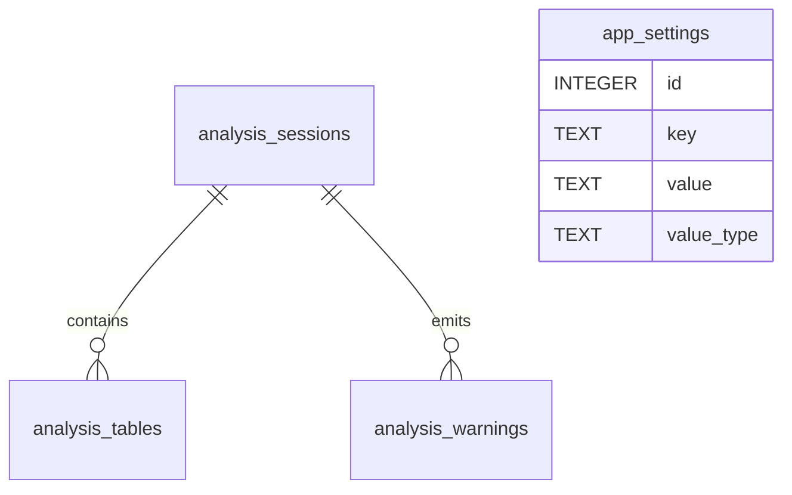

# Tabyte — Internal SQLite Entity Model v0.3

## Objective

Internal **optional** SQLite schema used when the CLI runs with `--persist`. SQLite is an application file store, not a public integration surface and not a substitute for the in-memory domain model.

## Principles

- Internal to Tabyte; not a public API.
- Small, auditable, locally migratable (`Migrate` on open).
- Prefer native SQLite affinities: `INTEGER`, `REAL`, `TEXT` (and `BLOB` only if needed later).
- Explicit foreign keys with `PRAGMA foreign_keys = ON`.
- Timestamps as ISO-8601 `TEXT`.
- Booleans as `INTEGER` `0`/`1` when used.

## Implemented schema

Matches `internal/persistence/sqlite/schema.go`.

### 1. `app_settings`

Local installation preferences.

| Column | SQLite type | Required | Notes |
|---|---|---:|---|
| id | INTEGER | Yes | Auto-increment PK |
| key | TEXT | Yes | Unique setting name |
| value | TEXT | Yes | Serialized value |
| value_type | TEXT | Yes | e.g. `string`, `number`, `bool` |
| created_at | TEXT | Yes | ISO-8601 |
| updated_at | TEXT | Yes | ISO-8601 |

Exposed via `GET/PUT /api/v1/settings` when persistence is enabled.

### 2. `analysis_sessions`

One analysis run.

| Column | SQLite type | Required | Notes |
|---|---|---:|---|
| id | TEXT | Yes | Stable session id |
| engine | TEXT | Yes | Logical engine |
| source_name | TEXT | No | Friendly input label |
| ddl_text | TEXT | Yes | Original DDL |
| ddl_hash | TEXT | Yes | Hash for tracing / dedup |
| parser_status | TEXT | Yes | Overall parse state |
| total_tables | INTEGER | Yes | Interpreted table count |
| warning_count | INTEGER | Yes | Warning total |
| error_count | INTEGER | Yes | Error total |
| estimated_total_bytes | INTEGER | No | Aggregated bytes |
| created_at | TEXT | Yes | ISO-8601 |
| updated_at | TEXT | Yes | ISO-8601 |

### 3. `analysis_tables`

Per-table summary inside a session.

| Column | SQLite type | Required | Notes |
|---|---|---:|---|
| id | TEXT | Yes | Persisted table id |
| session_id | TEXT | Yes | FK → `analysis_sessions.id` ON DELETE CASCADE |
| schema_name | TEXT | No | Logical schema |
| table_name | TEXT | Yes | Table name |
| row_size_bytes | INTEGER | No | Estimated row size |
| row_count_assumed | INTEGER | Yes | Assumed cardinality |
| growth_rate_value | REAL | No | Growth rate value |
| growth_rate_unit | TEXT | No | Growth unit |
| estimated_table_bytes | INTEGER | No | Estimated table volume |
| index_bytes | INTEGER | No | Index share if calculated |
| warning_count | INTEGER | Yes | Warnings for the table |
| created_at | TEXT | Yes | ISO-8601 |
| updated_at | TEXT | Yes | ISO-8601 |

Index: `idx_analysis_tables_session (session_id)`.

### 4. `analysis_warnings`

Structural alerts scoped to a session (optional table/column ids).

| Column | SQLite type | Required | Notes |
|---|---|---:|---|
| id | TEXT | Yes | Warning id |
| session_id | TEXT | Yes | FK → `analysis_sessions.id` ON DELETE CASCADE |
| table_id | TEXT | No | Optional table scope |
| column_id | TEXT | No | Optional column scope |
| code | TEXT | Yes | Technical code |
| severity | TEXT | Yes | Logical severity |
| category | TEXT | Yes | Semantic category |
| title | TEXT | Yes | Short title |
| message | TEXT | Yes | Message body |
| created_at | TEXT | Yes | ISO-8601 |

Index: `idx_analysis_warnings_session (session_id)`.

## Relationships

## Not implemented (future)

Earlier drafts also described:

- `analysis_columns`
- `analysis_indexes`
- `ai_insights`

Those are not in the current migration. Full column/index detail lives in the in-memory domain and API JSON; AI insights use an in-process provider interface, not a SQLite table.

## Integrity

- Primary keys on all tables
- Foreign keys with cascade delete from sessions
- `UNIQUE` on `app_settings.key`
- `NOT NULL` on structural essentials
