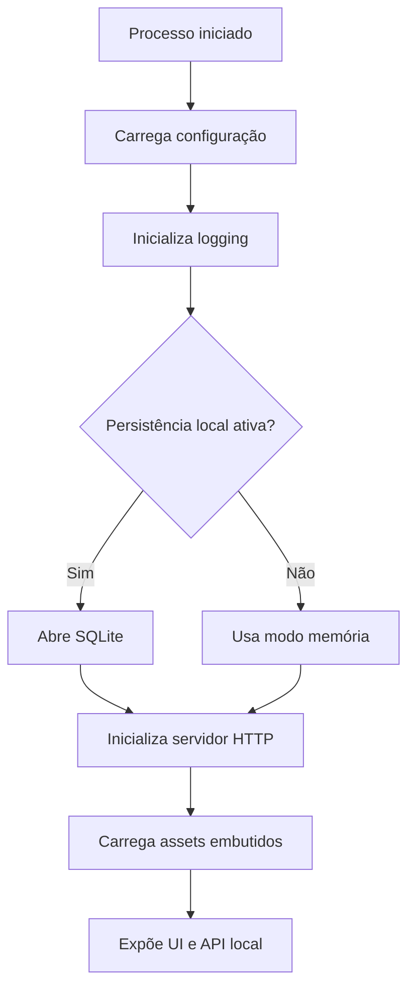

# Tabyte — Stack Sugerida v0.2

## Objetivo

Este documento define a **stack tecnológica sugerida** para o Tabyte, com foco em simplicidade operacional, distribuição local, manutenção evolutiva e aderência ao modelo de execução por CLI com interface web em `localhost`. O objetivo aqui é registrar decisões tecnológicas práticas, e não descrever funcionalidades do produto [1][2][3].

## Premissas técnicas

A stack deve atender a quatro restrições centrais:

- execução local em Windows e Ubuntu/Linux;
- distribuição simples para usuário técnico;
- ausência de banco servidor externo obrigatório;
- possibilidade de empacotar a interface web junto ao artefato principal.

Essas premissas favorecem fortemente uma solução em Go com servidor HTTP nativo, assets embutidos e persistência local opcional via SQLite [1][2][3].

## Stack principal recomendada

| Camada | Tecnologia sugerida | Justificativa |
|---|---|---|
| Linguagem principal | Go | Boa portabilidade, compilação simples e ecossistema forte para CLI e servidor local [1] |
| Servidor HTTP local | `net/http` | Biblioteca padrão suficiente para HTTP local e composição por handlers [1][4] |
| Embedding de assets | `embed` | Permite incluir arquivos estáticos dentro do binário em tempo de build [2][5] |
| Persistência local opcional | SQLite | Adequado como formato de arquivo de aplicação e armazenamento local interno [3][6] |
| Driver SQLite | `modernc.org/sqlite` ou equivalente puro Go | Ajuda a evitar CGO e simplifica portabilidade de build [7] |
| Contrato entre UI e backend | JSON sobre HTTP local | Simples, legível e adequado ao contexto local [1] |
| Testes | `testing` do Go | Suporte nativo suficiente para unidade, integração e smoke tests |
| Logs | `log/slog` ou logger simples | Observabilidade local sem dependência excessiva |

## Backend

A recomendação prática é começar com **Go + `net/http` puro**, sem framework adicional no servidor. A própria documentação e materiais do ecossistema destacam `net/http` como base suficiente para construção de servidores compostos por handlers, especialmente quando o escopo não exige complexidade distribuída ou middleware avançada desde o início [1][4].

Essa escolha reduz superfície de dependência, facilita onboarding de contribuidores e mantém o controle arquitetural no produto, em vez de deslocá-lo para abstrações prematuras de framework [1].

## CLI

A camada de execução deve nascer como **CLI host** do produto. Isso significa que a interface principal de ativação da aplicação será por terminal, independentemente de o usuário final consumir a UI no navegador.

A recomendação prática é começar com uma CLI simples, podendo usar biblioteca leve ou até implementação direta no início. O importante é que a CLI controle bootstrap, configuração, ciclo de vida do processo e inicialização do servidor local.

## UI web

A interface deve ser tratada como **front-end estático** servido localmente. A decisão mais pragmática é manter a UI buildada como conjunto de arquivos estáticos e embuti-los no binário final por `embed`, evitando entrega separada de diretórios auxiliares [2][5].

Isso mantém a distribuição mais enxuta e reduz problemas de instalação causados por caminhos relativos, assets soltos ou inconsistência entre backend e frontend [2].

## Persistência local

A persistência, quando necessária, deve usar **SQLite** como armazenamento interno leve. A documentação do próprio SQLite o posiciona como formato apropriado para preferências, estado local, metadados de aplicação, cache e arquivos de aplicação, o que se alinha muito bem ao Tabyte [3][6].

Essa escolha é preferível a um banco servidor externo porque elimina setup operacional desnecessário e preserva a identidade local-first da ferramenta [3].

## Estratégia de tipagem e dados

A comunicação entre backend local e UI deve usar **JSON**. Esse formato é suficiente para payloads técnicos, fácil de versionar e simples de inspecionar durante desenvolvimento e debugging local [1].

No armazenamento local, a modelagem deve seguir convenções simples de SQLite, com forte preferência por `TEXT`, `INTEGER` e `REAL`, evitando reproduzir no banco interno a rigidez tipológica dos bancos-alvo analisados [3].

## Distribuição

A stack deve favorecer geração de artefatos simples para Windows e Linux. A combinação **Go + assets embutidos + SQLite opcional** é especialmente adequada porque reduz dependências externas e centraliza a aplicação em um runtime previsível [2][3][1].

## O que evitar no início

- Framework HTTP pesado sem necessidade real.
- ORM grande antes de estabilizar o modelo interno.
- Dependência obrigatória de banco servidor externo.
- UI dependente de runtime separado em produção.
- Dependências que aumentem complexidade de build cross-platform sem ganho proporcional.

## Stack mínima recomendada

A forma mais simples e robusta de começar é esta:

- **Go** como linguagem principal [1]
- **`net/http`** como servidor local [1][4]
- **`embed`** para empacotar a UI [2][5]
- **SQLite opcional** para persistência local [3][6]
- **driver SQLite puro Go**, quando a persistência entrar [7]
- **JSON** como contrato interno da API local [1]

## Justificativa final

Essa stack mantém o Tabyte pequeno, distribuível, portátil e coerente com a proposta de ferramenta técnica local. Ela também preserva margem para crescimento arquitetural sem forçar complexidade desnecessária no primeiro ciclo de implementação [2][3][1]áticos da interface.

## Fluxo de boot arquitetural

Esse fluxo mostra apenas a composição estrutural da aplicação, não os casos de uso específicos da ferramenta.

## Escolhas arquiteturais recomendadas

### 1. `net/http` como base do servidor

A biblioteca padrão já entrega os elementos necessários para handlers e composição HTTP local, mantendo baixo acoplamento e boa previsibilidade [1][4].

### 2. `embed` para distribuição coesa

O mecanismo `embed` permite que a interface web seja carregada do próprio binário, o que favorece coesão de entrega e reduz problemas de empacotamento [2][5].

### 3. SQLite apenas como adaptador periférico

O SQLite deve ocupar posição periférica na arquitetura. Ele persiste estado útil, mas não deve comandar o desenho do domínio [3][6].

### 4. Parser isolado das engines

Embora parser e engines cooperem, o parser deve permanecer como módulo próprio. Isso melhora substituibilidade, testes e clareza arquitetural.

### 5. Adaptadores externos desacoplados

Integrações futuras, como IA ou exportadores adicionais, devem entrar como adaptadores externos, preservando o core estável.

## Riscos arquiteturais principais

- Lógica de domínio migrar indevidamente para handlers HTTP.
- Parser crescer misturado com regras específicas de engine.
- Persistência SQLite se tornar dependência estrutural cedo demais.
- Pacotes “utilitários” genéricos acumularem regra de negócio dispersa.
- Acoplamento excessivo entre interface e contratos internos.

## Evolução arquitetural prevista

A arquitetura proposta suporta crescimento incremental sem ruptura estrutural. Os pontos naturais de evolução são:

- adição de novas engines;
- novos adaptadores de exportação;
- persistência local mais rica;
- camada opcional de IA;
- automações CLI adicionais.

Como a estrutura é centrada em um domínio isolado e em bordas substituíveis, esses crescimentos podem ocorrer mantendo o deployment local simples [2][3][1].

## Conclusão estrutural

A arquitetura mais coerente para o Tabyte é um **monólito modular em Go**, iniciado por CLI, com servidor HTTP local baseado em `net/http`, interface web embutida por `embed` e SQLite opcional como armazenamento periférico. Essa combinação equilibra simplicidade de runtime, clareza arquitetural e evolução futura sem inflar o MVP [1][2][3].