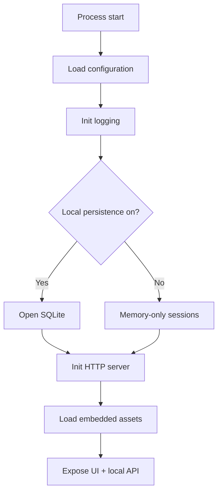

# Tabyte — Suggested Stack v0.3

## Objective

Record practical technology choices for a local CLI + localhost web UI product. This is not a feature list.

## Premises

- Local execution on Windows and Ubuntu/Linux
- Simple distribution for technical users
- No mandatory external database server
- Web UI packaged with the main artifact

## Stack in use

| Layer | Technology | Why |
|---|---|---|
| Primary language | Go | Portability, simple builds, strong CLI + local HTTP ecosystem |
| Local HTTP | `net/http` | Standard library is enough for local handlers |
| Asset embedding | `embed` | Ship UI inside the binary |
| Web UI | Static HTML / CSS / JS (`web/`) | No separate frontend runtime in production |
| Optional persistence | SQLite | Application-file storage |
| SQLite driver | Pure-Go (`modernc.org/sqlite` or equivalent) | Avoid CGO for cross-platform builds |
| UI ↔ backend contract | JSON over local HTTP | Simple and inspectable |
| Tests | Go `testing` + `tests/smoke.sh` | Unit + API smoke |
| Logs | `log/slog` or simple logger | Local observability without heavy deps |

## Backend

Start (and stay) with **Go + `net/http`**. No heavy HTTP framework is required for a local tool.

## CLI

The CLI is the product host: flags (`--persist`, `--no-open`), lifecycle, SQLite open, listen, optional browser open.

## Web UI

Static front-end served from the binary. Current surface: sessions sidebar, settings panel, DDL workspace, analysis results (tables, calculation, growth, warnings, signals, export, insights stub).

## Persistence

SQLite only when `--persist` is set. Without it, sessions live in memory for the process lifetime. Settings endpoints return `404` when persistence is off.

## Distribution

Prefer **Go + embedded assets + optional SQLite** so one binary covers Windows and Linux with minimal external deps.

## Avoid early

- Heavy HTTP frameworks without need
- Large ORMs before the internal model stabilizes
- Mandatory external DB servers
- A separate UI runtime for production delivery
- Dependencies that hurt cross-platform builds without proportional gain

## Boot flow

